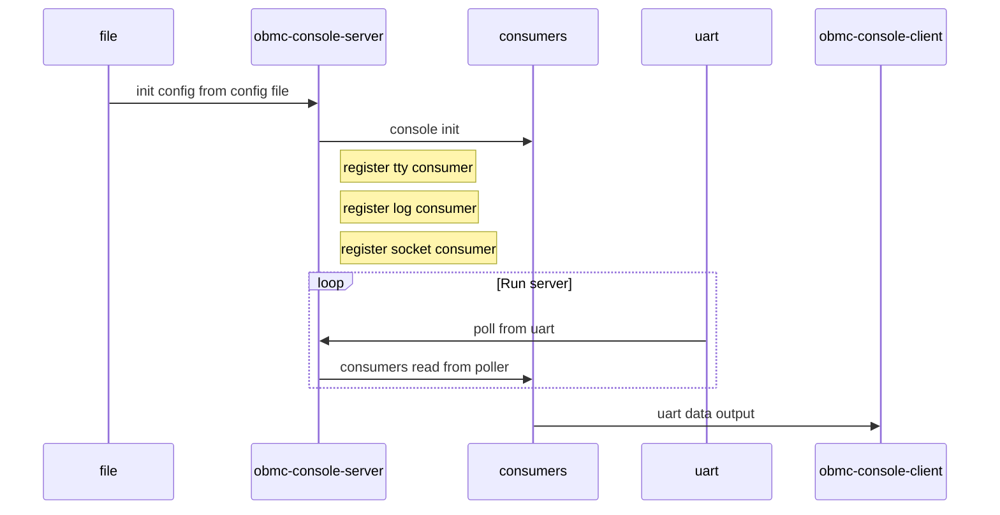
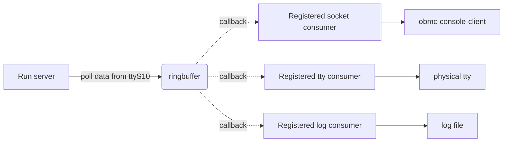

## obmc-console 的功能

obmc-console 提供了一个串口（虚拟串口）监听和转发的服务，其中obmc-console-server 根据提供的配置文件或者命令行参数，监听对应的串口。

监听串口数据设计有三种方式进行保存或者输出：

1. 保存为日志文件: 在配置文件中可以指定串口内容输出到日志文件内，这样方便BMC 收集和保存主板上各种组件的串口日志进行debug。
2. 输出到其他串口: 在配置文件中可以指定输出到其他串口，例如从ttyS5 接收到的数据转发到ttyS8，这样可以实现串口转发，在监听的同时方便连接外部串口进行实时debug。
3. 输出到socket连接: server 会根据配置文件或者命令行的参数 --console-id，建立一个socket链接，client 使用console-id可以连接到这个socket上，接收server 监听的串口内容，这个功能提供了将硬件串口转发到控制台的方法。可以通过这种方式来实现SOL

## obmc-console 的使用方法

### 直接使用

`obmc-console-server --console-id dev $(realpath pty2)`

### openbmc中使用service启动

```cpp
    #安装服务
    install -d ${D}${systemd_system_unitdir}/obmc-console@ttyS10.service.d
    #安装配置文件
    install -m 0644 ${UNPACKDIR}/env.conf ${D}${systemd_system_unitdir}/obmc-console@ttyS10.service.d/env.conf
```

### 其他使用方法

在上面 `obmc=console-server` 和 `obmc-console-client` 的功能基础上，openbmc 仓库中的obmc-console还添加了下面的使用方法：

1. `obmc-console-ssh.socket` 和 `obmc-console@.service` 配合实现串口的动态打开和关闭，方便进行动态管理
2. `obmc-console-ssh@.service` 和 `obmc-console-ssh.socket` 配合实现指定端口直接 访问串口

## obmc-console 的工作原理

整个工作原理可以使用下面这个图概述：



Run server中运行模式：



init config from config file
: 进程启动后先解析配置文件，读取波特率等信息

console init
: 根据读取到的配置文件设置串口驱动，这里有一个很重要的步骤是注册 “consumer”。这里的consumer 就是日志文件/socket连接/tty转发，每个consumer都会 消费 串口的输出结果，并将这些 结果输出 到其他界面，将这些共性封装成为handler，通过段注册的方式集中到一起

段注册:

```cpp
static const struct handler_type tty_handler = {
    .name = "tty",
    .init = tty_init, //这里会注册callback，也就是消费行为，将数据输入 文件/socket/串口
    .fini = tty_fini, //这里释放资源
    .baudrate = tty_baudrate,
};
//段注册处理行为
console_handler_register(&tty_handler);
```

Run server
: obmc-console-server 会将接收到的串口数据放到一个缓冲区中，通过`call back` 调用 `consumer` 的消费行为,这里每个消费者中都保存一份已读取的位置，不会出现已经被A读取的数据B读不到的情况。
每个消费行为读取结束后，还会调用输入的`callback`，将`tty/socket` 的输入转发到转口TX上

```cpp
//以socket为例，注册 串口输入和输出处理函数：
    client->poller = console_poller_register(sh->console, &sh->handler,
                    client_poll, client_timeout,
                    client->fd, POLLIN, client);
    client->rbc = console_ringbuffer_consumer_register(
        sh->console, client_ringbuffer_poll, client);
```

obmc-console-client
: `obmc-console-server` 开始监听串口后，根据socket 消费者的配置，会将`console-id`作为唯一标识符，创建一个本地socket连接，将串口数据转发到这个`socket` 上。`obmc-console-client` 接收一个参数`-c` 的配置文件或者`-i` 的`console-id`，读取`console-id`，连接对应的本地socket连接，将内容输出。

<!-- markdownlint-capture -->
<!-- markdownlint-disable -->
> 这个程序可以作为其他进程监控和串口输入的接口
{: .prompt-tip }
<!-- markdownlint-restore -->

## obmc-console 配置

### 常用配置

```ini
baud = 115200               # 监听串口波特率
logfile = /var/log/obmc-console-ttyS10.log # 监听日志文件
logsize = 5M                # 监听文件单个文件大小上限
console-id = ttyS10         # 监听串口设备文件
```

### uart mux

obmc-console 支持`mux uart` 这个在`obmc-console/docs/mux-support.md`{: .filepath}. 有描述：

```yaml
mux-gpios = MUX_CTL

[host1]
mux-index = 0
logfile = /var/log/console-host1.log

[host2]
mux-index = 1
logfile = /var/log/console-host2.log
AI构建项目
yaml
```

### vuart 配置

lpc-address
: 指定vuart `lpc`地址，自定义的vuart 未配置的话使用openbmc 的默认配置：`lpc-address = 0x3f8 sirq = 4`

sirq
: 指定vuart `sirq`, 自定义的vuart 未配置的话使用openbmc 的默认配置：`lpc-address = 0x3f8 sirq = 4`

### log配置

logfile
: log文件路径例如`mylog.log`

logsize
: log文件大小，设置格式：N k|kB|M|MB|G|GB, 超过指定大小后会将旧log转储为 `mylog.log.1`

### 串口转发配置

local-tty
: 将串口数据转发到 指定的串口

local-tty-baud
: 转发串口波特率

### 串口监听设置

upstream-tty
: 当server 命令行中未描述指定的串口时，使用这个选项描述

baud
: 指定监听串口频率

ringbuffer-size
: 指定串口缓存的大小，默认128K，设置格式：N k|kB|M|MB|G|GB
